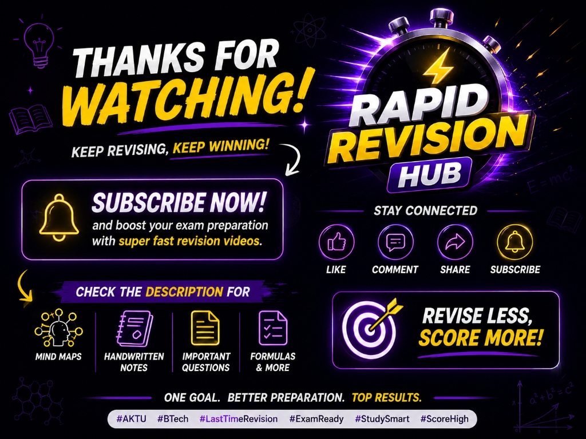
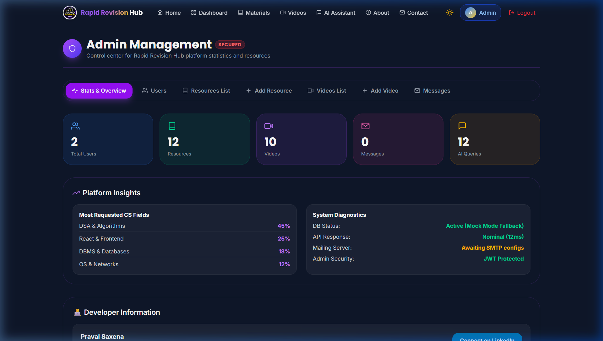

# 🎓 Rapid Revision Hub — Learn Smarter. Revise Faster.

<div align="center">



**A premium EdTech platform empowering education through AI technology**

[](https://sdgs.un.org/goals/goal4)
[](https://react.dev/)
[](https://vite.dev/)
[](https://nodejs.org/)
[](https://mongodb.com/)
[](https://tailwindcss.com/)

[Live Demo](https://rapid-revision-hub.vercel.app) · [Report Bug](https://github.com/Praval07/EduConnect---SDG-4-Quality-Education/issues) · [Request Feature](https://github.com/Praval07/EduConnect---SDG-4-Quality-Education/issues)

</div>

---

## 🔗 Live Demo

Production Website: [https://rapid-revision-hub.vercel.app](https://rapid-revision-hub.vercel.app)

---

## 📋 Table of Contents

- [Project Overview](#-project-overview)
- [SDG 4 — Quality Education](#-sdg-4--quality-education)
- [Features](#-features)
- [Tech Stack](#-tech-stack)
- [Screenshots](#-screenshots)
- [Installation Guide](#-installation-guide)
- [Environment Variables](#-environment-variables)
- [API Documentation](#-api-documentation)
- [Deployment Guide](#-deployment-guide)
- [Project Structure](#-project-structure)
- [Author Information](#-author-information)
- [License](#-license)

---

## 🌟 Project Overview

**Rapid Revision Hub** is a world-class, full-stack EdTech platform built to make quality education accessible to all students. Inspired by platforms like Coursera, Khan Academy, Notion, and ChatGPT, it combines premium design with practical features including AI-powered assistance, curated study materials, educational videos, and a personalized learning dashboard.

The platform is designed with a portfolio-quality, startup-grade aesthetic — glassmorphism UI, smooth Framer Motion animations, dark/light mode, purple/yellow accents, fully responsive design, and production-ready code architecture.

### Mission
> *"Learn Smarter. Revise Faster."* — Making quality education universally accessible, aligned with the United Nations Sustainable Development Goal 4.

---

## 🎯 SDG 4 — Quality Education

This project directly supports **UN Sustainable Development Goal 4: Quality Education**, which aims to:

- ✅ Ensure inclusive and equitable quality education
- ✅ Promote lifelong learning opportunities for all by 2030
- ✅ Ensure free, equitable and quality primary and secondary education
- ✅ Substantially increase the supply of qualified teachers
- ✅ Build and upgrade education facilities that are inclusive

**Rapid Revision Hub contributes by:**
- Providing free access to curated study materials and educational videos
- Offering an AI-powered study assistant for personalized learning
- Supporting digital literacy and skill development
- Making quality education resources accessible regardless of geographic location

---

## ✨ Features

### 🏠 Landing Page
- Modern hero section with SDG 4 badge and interactive elements.
- Uses the official **Rapid Revision Hub** banner image (`banner-rrh.jpg`).
- Animated statistics with IntersectionObserver counters.
- Features grid with hover animations.
- Student testimonials and an interactive FAQ accordion.

### 🔐 Authentication
- JWT-based user registration and login.
- Password strength meter + match validation in Register.
- Skip button fully functional — browse the platform as a Guest.
- Persistent login via custom `rrh_token` state.

### 📊 Student Dashboard
- SaaS-style stat cards (Resources Downloaded, Saved Resources, Videos Watched, AI Sessions).
- Study goal progress bars with animated fill.
- Quick action buttons with icon cards.
- Recent activity feed and recommended resources widget.

### 📚 Study Materials
- 12+ categorized educational resources (DSA, DBMS, OS, Computer Networks, Python, Java, React, NodeJS, MongoDB).
- Real-time search with debouncing.
- Category filter chips and resource cards with download/save functionality.
- Download count tracking and pagination support.

### 🎥 Educational Videos
- Real YouTube integration matching official channels.
- YouTube embed player modal.
- Video thumbnail grid with category filters and "Trending" toggle.
- "Watch Later" bookmark functionality.

### 🤖 AI Study Assistant
- ChatGPT-style conversation UI with typing indicators and copy-to-clipboard.
- Markdown rendering for rich answers.
- Real-time intelligent Google Gemini API integration with conversation history.
- Suggested prompt chips to jump-start study sessions.

### 👤 Student Profile
- Avatar with student initials.
- Editable profile form (name, college, course, branch, semester, mobile number).
- Skills management with tag suggestions.
- SDG 4 learner badge.

### 📞 Contact Page
- Modern contact form with validation.
- Success toast notification on submission.
- Direct contact details and SDG 4 mission statement.

### 🔑 Admin Dashboard
- Restricted admin portal accessible at `/admin-panel-rrh-2026` for administrative accounts.
- View and manage study resources and video library.
- View user-submitted messages and contact requests.
- Detailed administrative statistics.

---

## 🛠️ Tech Stack

### Frontend
| Technology | Version | Purpose |
|-----------|---------|---------|
| React | 19 | UI Framework |
| Vite | 8 | Build Tool |
| React Router DOM | 7 | Client-side Routing |
| Tailwind CSS | 4 | Utility-first Styling |
| Framer Motion | 12 | Animations |
| Axios | 1.18 | HTTP Client |
| React Icons | 5 | Icon Library |
| React Markdown | 10 | AI Response Rendering |
| Context API | Built-in | State Management |

### Backend
| Technology | Version | Purpose |
|-----------|---------|---------|
| Node.js | 24 | Runtime |
| Express.js | 5 | Web Framework |
| MongoDB | Atlas | Database |
| Mongoose | 9 | ODM |
| JWT | 9 | Authentication |
| bcryptjs | 3 | Password Hashing |
| CORS | 2.8 | Cross-Origin Requests |
| Google Generative AI | 0.21 | AI Integration (Gemini API) |

---

## 📸 Screenshots

### Landing Page


### Authentication


### Dashboard


### Study Materials


### Educational Videos


### AI Assistant


### Profile


### Contact


### Admin Dashboard


---

## 🚀 Installation Guide

### Prerequisites
- Node.js v18+ 
- npm v8+
- MongoDB Atlas account (free tier works great)
- Git

### 1. Clone the Repository
```bash
git clone https://github.com/Praval07/EduConnect---SDG-4-Quality-Education.git
cd EduConnect---SDG-4-Quality-Education
```

### 2. Install Dependencies
You can install both frontend and backend dependencies using the root helper script:
```bash
npm run install:all
```

### 3. Configure Environment Variables
Create `.env` files in both the `backend/` and `frontend/` folders. (See [Environment Variables](#-environment-variables) below).

### 4. Seed Database
Optional step to populate the database with mock resources and videos:
```bash
npm run seed
```

### 5. Run Locally
To run both backend server and frontend client concurrently:
```bash
npm run dev
```

---

## 🔑 Environment Variables

### Backend (`backend/.env`)
Create a file named `.env` in the `backend` directory:
```env
PORT=5000
MONGODB_URI=mongodb+srv://<username>:<password>@cluster0.mongodb.net/database_name?retryWrites=true&w=majority
JWT_SECRET=your_super_secret_jwt_key_change_in_production
NODE_ENV=development
GEMINI_API_KEY=your_google_gemini_api_key_here
```

### Frontend (`frontend/.env`)
Create a file named `.env` in the `frontend` directory:
```env
VITE_API_URL=http://localhost:5000
VITE_GEMINI_API_KEY=your_google_gemini_api_key_here
```

---

## 📡 API Documentation

### Base URL
```
/api
```

### Authentication Routes
| Method | Endpoint | Description | Auth Required |
|--------|----------|-------------|---------------|
| POST | `/auth/register` | Register new user | No |
| POST | `/auth/login` | Login user | No |
| GET | `/auth/me` | Get current user | Yes |

### Resource Routes
| Method | Endpoint | Description | Auth |
|--------|----------|-------------|------|
| GET | `/resources` | Get all resources | No |
| POST | `/resources` | Create resource | Yes |
| PUT | `/resources/:id` | Update resource | Yes |
| DELETE | `/resources/:id` | Delete resource | Yes |
| POST | `/resources/:id/download` | Track download | No |

### Video Routes
| Method | Endpoint | Description | Auth |
|--------|----------|-------------|------|
| GET | `/videos` | Get all videos | No |

### Profile Routes
| Method | Endpoint | Description | Auth |
|--------|----------|-------------|------|
| GET | `/profile` | Get user profile | Yes |
| PUT | `/profile` | Update profile | Yes |
| POST | `/profile/save-resource/:id` | Toggle saved resource | Yes |

### Contact Route
| Method | Endpoint | Description | Auth |
|--------|----------|-------------|------|
| POST | `/contact` | Submit contact form | No |

### AI Assistant Routes
| Method | Endpoint | Description | Auth |
|--------|----------|-------------|------|
| POST | `/ai/chat` | Send message to Gemini | Yes |
| GET | `/ai/history` | Get chat history | Yes |

---

## 🚀 Deployment Guide

### Frontend Deployment (Vercel)
The frontend is built using React + Vite and deployed on Vercel.
1. Connect your GitHub repository to Vercel.
2. Configure build settings:
   - **Framework Preset:** Vite
   - **Build Command:** `npm run build`
   - **Output Directory:** `dist`
   - **Root Directory:** `frontend`
3. Add environment variables `VITE_API_URL` and `VITE_GEMINI_API_KEY` to Vercel settings.
4. Click deploy. Vercel automatically deploys every push to the `main` branch.

### Backend Deployment (Express.js)
The backend can be deployed to Render, Heroku, or any Node.js hosting platform.
1. Create a new Web Service on your hosting provider.
2. Connect your GitHub repository.
3. Configure settings:
   - **Build Command:** `cd backend && npm install`
   - **Start Command:** `cd backend && node server.js`
4. Define the backend environment variables on your server dashboard.

---

## 📂 Project Structure

```
EduConnect---SDG-4-Quality-Education/
├── backend/
│   ├── config/          # Database configuration
│   ├── controllers/     # Route logic (auth, resource, video, ai, contact)
│   ├── middleware/      # Auth validation
│   ├── models/          # Mongoose Schemas (User, Resource, Video, Contact, AIHistory)
│   ├── routes/          # Express route definitions
│   ├── seed/            # Seeding scripts
│   ├── utils/           # Helper scripts & In-memory database fallback
│   ├── server.js        # Entry point
│   └── package.json
├── frontend/
│   ├── public/          # Static assets (logos, banner)
│   ├── src/
│   │   ├── components/  # Reusable UI widgets
│   │   ├── context/     # Auth and Theme providers
│   │   ├── hooks/       # Custom hooks (debounce, fetch, localStorage)
│   │   ├── pages/       # Page components (Landing, Login, Register, Dashboard, etc.)
│   │   ├── services/    # Axios API client setup
│   │   ├── utils/       # Utility helper functions
│   │   ├── App.jsx      # Main application router
│   │   ├── index.css    # Style configuration
│   │   └── main.jsx
│   ├── package.json
│   └── vite.config.js
├── screenshots/         # Latest UI screenshots
├── vercel.json          # Vercel SPA routing rules
└── package.json         # Root monorepo scripts
```

---

## 👤 Author Information

**Author:** Praval Saxena
- 📧 **Email:** [rapidrevisionhub@gmail.com](mailto:rapidrevisionhub@gmail.com)
- 📞 **Phone:** +91 7533828012
- 🔗 **LinkedIn:** [Praval Saxena](https://www.linkedin.com/in/praval-saxena-287214311/)
- 🐙 **GitHub:** [@Praval07](https://github.com/Praval07)

---

## 📄 License

This project is licensed under the MIT License — see the [LICENSE](LICENSE) file for details.

---

<div align="center">

**Made with ❤️ for SDG 4 — Quality Education**

*Rapid Revision Hub — Learn Smarter. Revise Faster.*

[](https://github.com/Praval07/EduConnect---SDG-4-Quality-Education)

</div>
