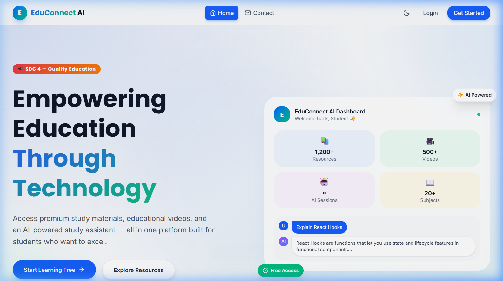
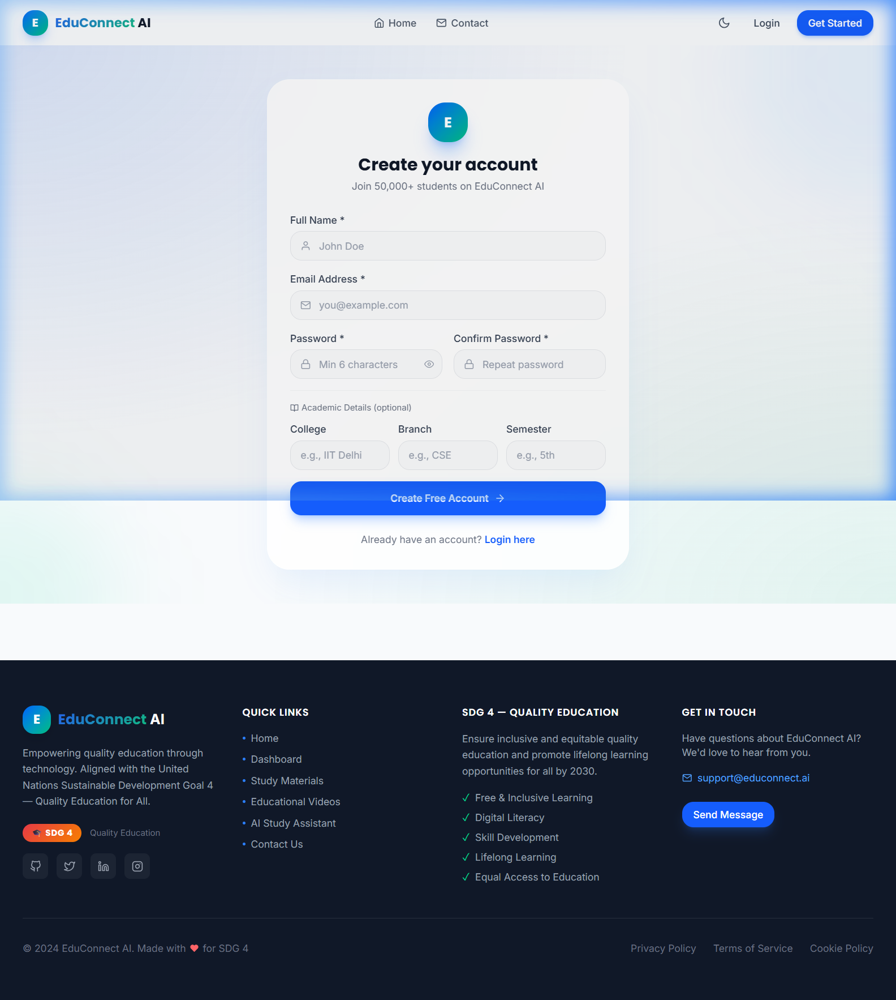
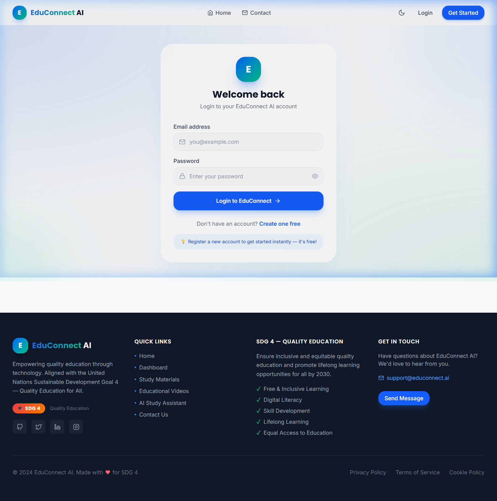
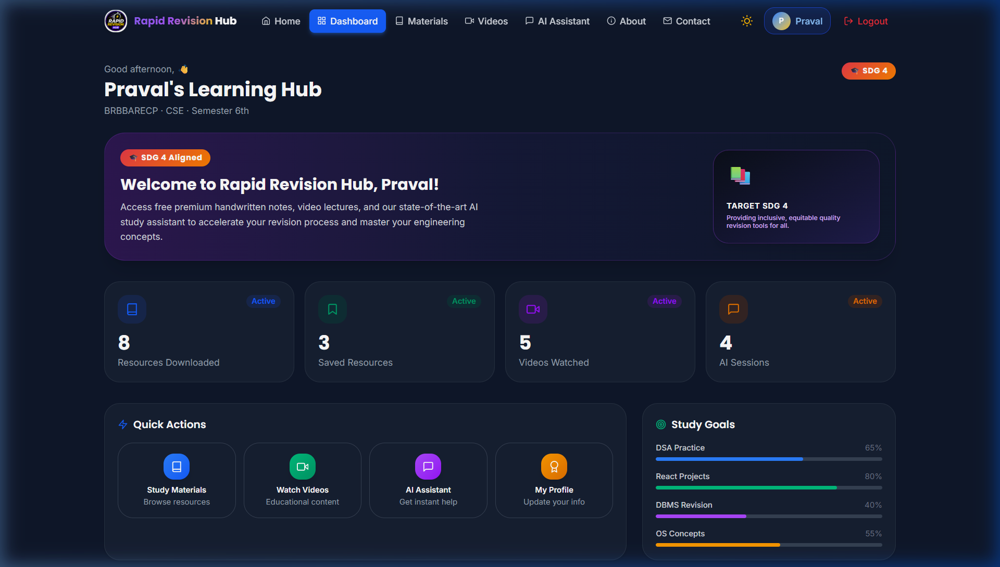
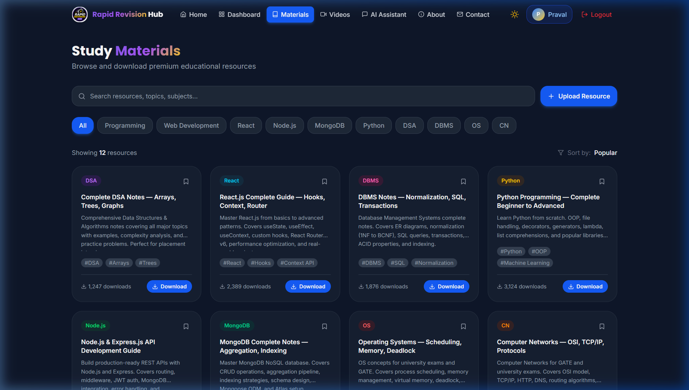
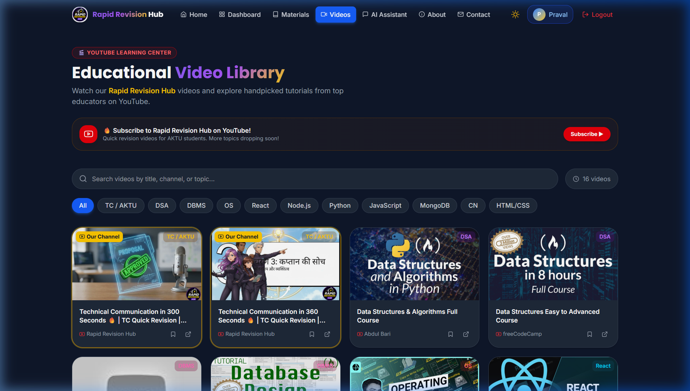
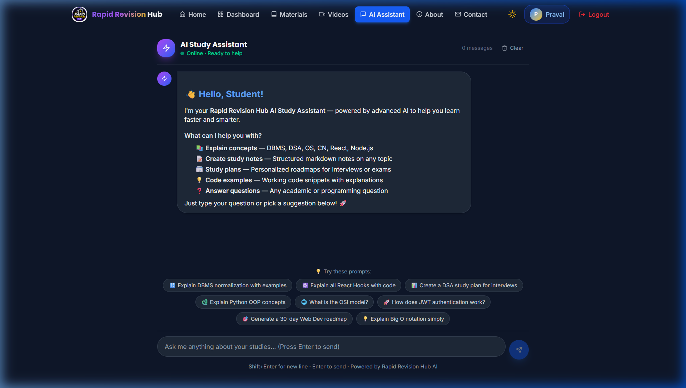
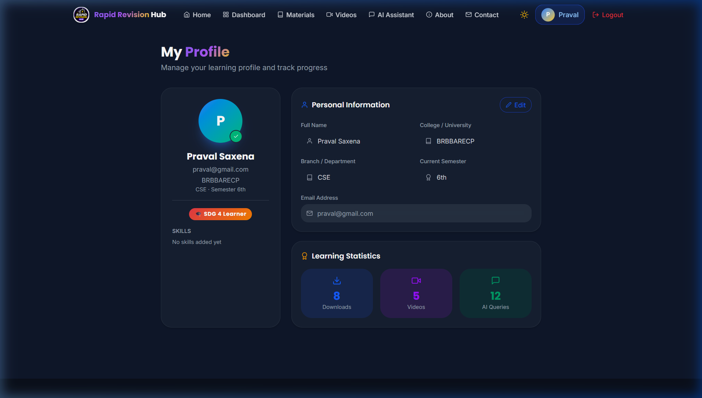
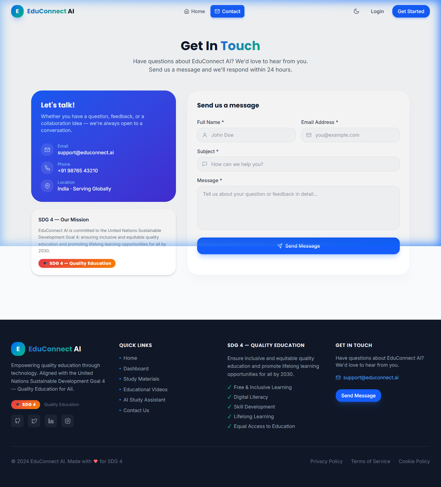

# 🎓 EduConnect AI — Quality Education Platform

<div align="center">



**A premium EdTech platform empowering education through AI technology**

[](https://sdgs.un.org/goals/goal4)
[](https://reactjs.org/)
[](https://nodejs.org/)
[](https://mongodb.com/)
[](https://tailwindcss.com/)

[Live Demo](#) · [Report Bug](https://github.com/Praval07/EduConnect---SDG-4-Quality-Education/issues) · [Request Feature](https://github.com/Praval07/EduConnect---SDG-4-Quality-Education/issues)

</div>

---

## 📋 Table of Contents

- [Project Overview](#-project-overview)
- [SDG 4 — Quality Education](#-sdg-4--quality-education)
- [Features](#-features)
- [Tech Stack](#-tech-stack)
- [Screenshots](#-screenshots)
- [Installation Guide](#-installation-guide)
- [API Documentation](#-api-documentation)
- [Deployment Guide](#-deployment-guide)
- [Project Structure](#-project-structure)
- [Contributing](#-contributing)
- [License](#-license)

---

## 🌟 Project Overview

**EduConnect AI** is a world-class, full-stack EdTech platform built to make quality education accessible to all students. Inspired by platforms like Coursera, Khan Academy, Notion, and ChatGPT, it combines premium design with practical features including AI-powered assistance, curated study materials, educational videos, and a personalized learning dashboard.

The platform is designed with a portfolio-quality, startup-grade aesthetic — glassmorphism UI, smooth Framer Motion animations, dark/light mode, fully responsive design, and production-ready code architecture.

### Mission
> *"Empowering Education Through Technology"* — Making quality education universally accessible, aligned with the United Nations Sustainable Development Goal 4.

---

## 🎯 SDG 4 — Quality Education

This project directly supports **UN Sustainable Development Goal 4: Quality Education**, which aims to:

- ✅ Ensure inclusive and equitable quality education
- ✅ Promote lifelong learning opportunities for all by 2030
- ✅ Ensure free, equitable and quality primary and secondary education
- ✅ Substantially increase the supply of qualified teachers
- ✅ Build and upgrade education facilities that are inclusive

**EduConnect AI contributes by:**
- Providing free access to curated study materials and educational videos
- Offering an AI-powered study assistant for personalized learning
- Supporting digital literacy and skill development
- Making quality education resources accessible regardless of geographic location

---

## ✨ Features

### 🏠 Landing Page
- Modern hero section with SDG 4 badge
- Animated statistics with IntersectionObserver counters
- Features grid with hover animations
- Student testimonials
- Interactive FAQ accordion
- Compelling CTA section

### 🔐 Authentication
- JWT-based user registration and login
- Bcrypt password hashing (12 rounds)
- Protected routes with auto-redirect
- Persistent login via localStorage
- Logout functionality

### 📊 Dashboard
- SaaS-style stat cards (Resources, Saved, Videos, AI Sessions)
- Quick action buttons with icon cards
- Study goal progress bars with animated fill
- Recent activity feed
- Recommended resources widget
- Personalized greeting

### 📚 Study Materials
- 12+ categorized educational resources
- Real-time search with debouncing
- Category filter chips (10 categories)
- Resource cards with download/save
- Download count tracking
- Pagination support
- Sort functionality

### 🎥 Educational Videos
- YouTube embed player modal
- Video thumbnail grid with category filters
- Trending toggle filter
- Watch Later bookmark functionality
- View count display
- Instructor info and duration

### 🤖 AI Study Assistant
- ChatGPT-style conversation UI
- Markdown rendering for rich responses
- Intelligent mock responses for all major CS topics:
  - DBMS, DSA, React, Node.js, Python, OS, CN
- Typing indicator animation
- Copy message to clipboard
- Suggested prompts
- Auto-scroll to latest message
- Session management
- Optional OpenAI integration

### 👤 Student Profile
- Avatar with initials
- Editable profile form (name, college, branch, semester)
- Skills management with suggestions
- Learning statistics display
- SDG 4 learner badge

### 📞 Contact Page
- Modern contact form with validation
- Success animation on submission
- Contact information display
- SDG 4 mission statement

### 🧭 Navigation
- Glassmorphism navbar with scroll effects
- Mobile drawer with spring animation
- Dark/light mode toggle
- User avatar in nav
- Active route highlighting

---

## 🛠️ Tech Stack

### Frontend
| Technology | Version | Purpose |
|-----------|---------|---------|
| React | 18 | UI Framework |
| Vite | 8 | Build Tool |
| React Router DOM | 6 | Client-side Routing |
| Tailwind CSS | 4 | Utility-first Styling |
| Framer Motion | Latest | Animations |
| Axios | Latest | HTTP Client |
| React Icons | Latest | Icon Library |
| React Markdown | Latest | AI Response Rendering |
| Context API | Built-in | State Management |

### Backend
| Technology | Version | Purpose |
|-----------|---------|---------|
| Node.js | 24 | Runtime |
| Express.js | 5 | Web Framework |
| MongoDB | Atlas | Database |
| Mongoose | 8 | ODM |
| JWT | Latest | Authentication |
| bcryptjs | Latest | Password Hashing |
| CORS | Latest | Cross-Origin Requests |

### Design System
| Element | Value |
|---------|-------|
| Primary Color | `#2563EB` (Blue 600) |
| Secondary Color | `#10B981` (Emerald 500) |
| Accent Color | `#F59E0B` (Amber 500) |
| Dark Background | `#0F172A` |
| Light Background | `#F8FAFC` |
| Font (Headings) | Poppins |
| Font (Body) | Inter |

---

## 📸 Screenshots

### Landing Page


### Authentication



### Dashboard
> Connect to MongoDB Atlas and register to see the full dashboard


### Study Materials


### Educational Videos


### AI Study Assistant


### Student Profile


### Contact Page


---

## 🚀 Installation Guide

### Prerequisites
- Node.js v18+ 
- npm v8+
- MongoDB Atlas account (free tier works great)
- Git

### 1. Clone the Repository
```bash
git clone https://github.com/Praval07/EduConnect---SDG-4-Quality-Education.git
cd EduConnect---SDG-4-Quality-Education
```

### 2. Backend Setup

```bash
cd backend
npm install
```

Create `.env` file:
```env
PORT=5000
MONGODB_URI=mongodb+srv://<username>:<password>@cluster0.xxxxx.mongodb.net/educonnect?retryWrites=true&w=majority
JWT_SECRET=your_super_secret_jwt_key_change_in_production
NODE_ENV=development
OPENAI_API_KEY=your_openai_api_key_optional
```

Start backend:
```bash
npm start
# or for development with auto-restart:
npm install -g nodemon
nodemon server.js
```

Optionally seed the database:
```bash
npm run seed
```

### 3. Frontend Setup

```bash
cd ../frontend
npm install
npm run dev
```

Open `http://localhost:5173` in your browser.

### 4. Full Stack (Both Together)

```bash
# Terminal 1 — Backend
cd backend && npm start

# Terminal 2 — Frontend
cd frontend && npm run dev
```

---

## 📡 API Documentation

### Base URL
```
http://localhost:5000/api
```

### Authentication Routes

| Method | Endpoint | Description | Auth Required |
|--------|----------|-------------|---------------|
| POST | `/auth/register` | Register new user | No |
| POST | `/auth/login` | Login user | No |
| GET | `/auth/me` | Get current user | Yes |

#### Register Request
```json
{
  "name": "John Doe",
  "email": "john@example.com",
  "password": "securepassword",
  "college": "IIT Delhi",
  "branch": "CSE",
  "semester": "5"
}
```

#### Login Request
```json
{
  "email": "john@example.com",
  "password": "securepassword"
}
```

#### Auth Response
```json
{
  "success": true,
  "token": "eyJhbGciOiJIUzI1NiIsInR5cCI6IkpXVCJ9...",
  "user": {
    "id": "65abc123...",
    "name": "John Doe",
    "email": "john@example.com",
    "stats": { "resourcesDownloaded": 0, "aiSessions": 0 }
  }
}
```

### Resource Routes

| Method | Endpoint | Description | Auth |
|--------|----------|-------------|------|
| GET | `/resources` | Get all resources | No |
| POST | `/resources` | Create resource | Yes |
| PUT | `/resources/:id` | Update resource | Yes |
| DELETE | `/resources/:id` | Delete resource | Yes |
| POST | `/resources/:id/download` | Track download | No |

**Query Parameters for GET `/resources`:**
- `?search=react` — Search by title/description
- `?category=DSA` — Filter by category
- `?page=1&limit=12` — Pagination
- `?sort=-downloadCount` — Sort

### Video Routes

| Method | Endpoint | Description | Auth |
|--------|----------|-------------|------|
| GET | `/videos` | Get all videos | No |
| POST | `/videos/:id/view` | Track view | No |

### Profile Routes

| Method | Endpoint | Description | Auth |
|--------|----------|-------------|------|
| GET | `/profile` | Get user profile | Yes |
| PUT | `/profile` | Update profile | Yes |
| POST | `/profile/save-resource/:id` | Toggle saved resource | Yes |

### Contact Route

| Method | Endpoint | Description | Auth |
|--------|----------|-------------|------|
| POST | `/contact` | Submit contact form | No |

### AI Assistant Routes

| Method | Endpoint | Description | Auth |
|--------|----------|-------------|------|
| POST | `/assistant/chat` | Send message | Yes |
| GET | `/assistant/history` | Get chat history | Yes |

**Chat Request:**
```json
{
  "message": "Explain DBMS normalization",
  "sessionId": "optional-session-id"
}
```

**Chat Response:**
```json
{
  "success": true,
  "response": "## 📚 DBMS Normalization\n\n...",
  "sessionId": "65xyz..."
}
```

### Health Check
```
GET /api/health → { status: "OK", message: "EduConnect AI API is running!" }
```

---

## 🌐 Deployment Guide

### Frontend — Vercel (Recommended)

1. Push code to GitHub
2. Connect repo to [Vercel](https://vercel.com)
3. Set root directory to `frontend`
4. Add environment variable:
   ```
   VITE_API_URL=https://your-backend.railway.app
   ```
5. Deploy!

### Backend — Railway (Recommended)

1. Connect GitHub repo to [Railway](https://railway.app)
2. Set root directory to `backend`
3. Add environment variables:
   ```
   PORT=5000
   MONGODB_URI=your_atlas_connection_string
   JWT_SECRET=your_jwt_secret
   NODE_ENV=production
   ```
4. Deploy!

### Backend — Render

1. Create Web Service on [Render](https://render.com)
2. Set build command: `cd backend && npm install`
3. Set start command: `cd backend && npm start`
4. Add environment variables
5. Deploy!

### MongoDB Atlas Setup

1. Create free account at [MongoDB Atlas](https://mongodb.com/atlas)
2. Create a free M0 cluster
3. Add database user with read/write permissions
4. Whitelist IP `0.0.0.0/0` for all connections
5. Get connection string and add to backend `.env`
6. Run seed: `cd backend && npm run seed`

---

## 📁 Project Structure

```
EduConnect/
├── frontend/                    # React + Vite frontend
│   ├── src/
│   │   ├── assets/             # Static assets
│   │   ├── components/         # Reusable components
│   │   │   ├── Navbar.jsx      # Navigation with mobile drawer
│   │   │   ├── Footer.jsx      # Footer with SDG info
│   │   │   ├── ProtectedRoute.jsx
│   │   │   └── AnimatedCounter.jsx
│   │   ├── pages/              # Route components
│   │   │   ├── Landing.jsx     # Landing page
│   │   │   ├── Login.jsx       # Login page
│   │   │   ├── Register.jsx    # Registration page
│   │   │   ├── Dashboard.jsx   # User dashboard
│   │   │   ├── StudyMaterials.jsx
│   │   │   ├── Videos.jsx      # YouTube videos
│   │   │   ├── AIAssistant.jsx # AI chat interface
│   │   │   ├── Profile.jsx     # User profile
│   │   │   ├── Contact.jsx     # Contact form
│   │   │   └── NotFound.jsx    # 404 page
│   │   ├── context/            # React Context
│   │   │   ├── AuthContext.jsx # Auth state management
│   │   │   └── ThemeContext.jsx # Dark/light mode
│   │   ├── services/           # API services
│   │   │   └── api.js          # Axios instance
│   │   ├── App.jsx             # Router + providers
│   │   ├── main.jsx            # Entry point
│   │   └── index.css           # Global styles
│   ├── index.html              # HTML template
│   └── vite.config.js          # Vite configuration
│
├── backend/                    # Node.js + Express backend
│   ├── config/
│   │   └── db.js               # MongoDB connection
│   ├── models/                 # Mongoose models
│   │   ├── User.js
│   │   ├── Resource.js
│   │   ├── Video.js
│   │   ├── Contact.js
│   │   └── AIHistory.js
│   ├── controllers/            # Business logic
│   │   ├── authController.js
│   │   ├── resourceController.js
│   │   ├── videoController.js
│   │   ├── profileController.js
│   │   ├── contactController.js
│   │   └── aiController.js
│   ├── routes/                 # Express routes
│   │   ├── auth.js
│   │   ├── resources.js
│   │   ├── videos.js
│   │   ├── profile.js
│   │   ├── contact.js
│   │   └── ai.js
│   ├── middleware/
│   │   ├── auth.js             # JWT verification
│   │   └── errorHandler.js
│   ├── seed/
│   │   └── seedData.js         # Initial data seeder
│   ├── server.js               # Express app entry point
│   ├── .env.example            # Environment template
│   └── package.json
│
├── screenshots/                # Project screenshots
├── .gitignore
└── README.md
```

---

## 🗃️ Database Schema

### User Collection
```javascript
{
  name: String,
  email: String (unique),
  password: String (hashed),
  avatar: String,
  college: String,
  branch: String,
  semester: String,
  skills: [String],
  stats: {
    resourcesDownloaded: Number,
    videosWatched: Number,
    aiQueries: Number,
    savedResources: Number,
    aiSessions: Number
  },
  savedResourceIds: [ObjectId],
  role: "student" | "admin",
  createdAt: Date
}
```

### Resource Collection
```javascript
{
  title: String,
  description: String,
  category: String, // "DSA" | "React" | "Python" | ...
  fileUrl: String,
  type: "pdf" | "notes" | "slides" | "link",
  downloadCount: Number,
  tags: [String],
  uploadedBy: ObjectId (User),
  isPublic: Boolean,
  createdAt: Date
}
```

### Video Collection
```javascript
{
  title: String,
  description: String,
  category: String,
  youtubeId: String,
  duration: String,
  instructor: String,
  views: Number,
  trending: Boolean,
  tags: [String],
  createdAt: Date
}
```

---

## 🤝 Contributing

1. Fork the repository
2. Create your feature branch: `git checkout -b feature/AmazingFeature`
3. Commit your changes: `git commit -m 'Add AmazingFeature'`
4. Push to the branch: `git push origin feature/AmazingFeature`
5. Open a Pull Request

---

## 📄 License

This project is licensed under the MIT License — see the [LICENSE](LICENSE) file for details.

---

## 👨‍💻 Author

**Praval** — [GitHub](https://github.com/Praval07)

---

<div align="center">

**Made with ❤️ for SDG 4 — Quality Education**

*EduConnect AI — Empowering Education Through Technology*

[](https://github.com/Praval07/EduConnect---SDG-4-Quality-Education)

</div>
